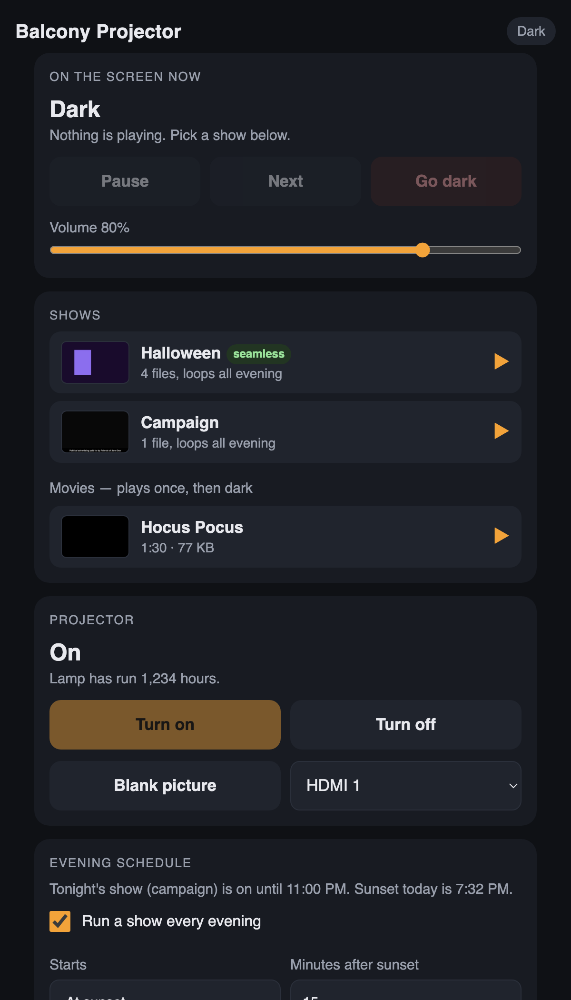

# Balcony Projector

A Raspberry Pi that loops videos on a see-through screen hung on the balcony,
facing the street. You run it from your phone: pick a show, go dark, shuffle,
set an optional evening schedule. Content is made on a laptop and sent to the Pi.

Nothing but the video is ever drawn on the screen. If something goes wrong, the
phone page tells you what to do.



More: [manage videos](docs/screenshots/manage-videos.png),
[settings](docs/screenshots/settings.png).

## The setup

- **Screen:** 5 x 9 ft gray holographic rear-projection mesh at the balcony
  railing. Black in a video is invisible on it; anything bright floats in midair.
- **Projector:** Optoma ML750ST on the window sill, projecting through the glass
  to the screen. It has one HDMI port and no network port. You turn it on and off
  by hand; it needs no cooldown. Set "rear projection" in its own menu so text
  reads correctly from the street.
- **Player:** Raspberry Pi 4, Raspberry Pi OS Lite (64-bit), no desktop. The
  Pi's HDMI 0 port (the one next to the power jack) goes straight into the
  projector. The Pi stays on all the time and keeps looping whatever was last
  chosen, so the show is there the moment the projector warms up.
- **Videos** live on the Pi in folders under `~/media`:
  - `halloween` loops all evening
  - `campaign` loops all evening and is treated as political advertising (see below)
  - `movies` play once, then the screen goes dark

## Install

On the Pi, in one line:

```bash
curl -fsSL https://raw.githubusercontent.com/josephykwan/balcony-projector/main/get.sh | sudo bash
```

Or, from a copy of this folder on the Pi:

```bash
sudo ./install.sh --quiet-boot --share --timezone America/Chicago
```

- It installs `mpv` and `python3-flask`, nothing else.
- It sets the HDMI output to the projector's native 1280x800.
- `--quiet-boot` hides the boot text and login prompt so the street only ever
  sees black or video.
- `--share` makes the `~/media` folder show up as a network drive on your laptop
  (see "Adding videos").
- `--timezone` sets the Pi's clock so the schedule fires at the right time.
- `--projector-link` is only for projectors with a LAN port. The Optoma has none.

Reboot once afterwards. The installer prints the address for your phone,
normally `http://balcony.local:8080/`. Add it to your phone's home screen.

To remove everything except your videos:

```bash
sudo ./uninstall.sh
```

## Using the phone page

**On the screen now.** A live picture of what the projector is showing, taken
from the player itself, with Pause, Next, Shuffle and Go dark. Go dark stops
playback and leaves the screen black; turn the projector off by hand when you
are done for the night.

**Shows.** Each playlist is a row. Tap ▶ to play the whole thing on a loop, or
tap the row to open it and pick one video to loop on its own. Movies play once
and then the screen goes dark. Whatever was playing carries on after a power
cut.

**Evening schedule (optional).** The projector is switched by hand, but the
schedule is still handy for changing what plays: for example the Halloween loop
from sunset and dark at 11. Start at sunset (plus or minus some minutes) or at a
set time; end at a set time or at sunrise. Seasons are date ranges that pick the
show: `10-01` to `10-31` for Halloween every year, `2026-09-16` to `2026-11-03`
for the campaign this year. The first matching season wins. If you start
something yourself during the window, the schedule leaves it alone.

**Manage videos.** Upload a ready file, switch files on and off, reorder,
remove. Make a new playlist, rename one, or delete one. A playlist is just a
folder; "loops" playlists play round and round, "plays once" playlists play one
video and then go dark.

**Settings.** Sound output, whether to carry on after a power cut, quiet-hours
dimming, location for sunset, phone alerts, a PIN, and, for a projector with a
LAN port, PJLink control.

**PIN.** Anyone on your Wi-Fi can open the page. Set a 4 to 8 digit PIN in
Settings and the page asks for it once per phone.

## Making and sending content: the studio

Open **`http://balcony.local:8080/studio/`** in Chrome, Edge or Safari on your
laptop. Nothing to install; the page is served by the Pi and all the work
happens in your browser.

**Make a show.** Pick a template (Campaign, Halloween, Holiday, Custom), type a
few lines, watch the preview play, press **Send to balcony**. The browser
renders the show as a 1280x800 MP4 and uploads it; the Pi starts playing it
straight away. Campaign shows require the "Paid for by" line and carry it on
every frame. Halloween has a built-in animated pumpkin or ghost; drop your own
artwork PNG in any template to use that instead, or a logo for the campaign
wordmark. Under Fine-tune you can add a glowing "window" frame that the artwork
appears to come out of, and the "Text emerge" effect pushes 3D-looking letters
toward the street.

**Send a video** made anywhere else: an AtmosFX clip, something exported from
Keynote or Canva, a phone video. Drop it in, choose the playlist, press Send.
It is converted on the laptop into exactly what the Pi plays (letterboxed on
black, near-black made pure black, over-bright frames toned down, the end
blended into the start so it loops without a jump) and uploaded.

If you would rather make content in a full editor, **Keynote** on a Mac is a
good fit: black slide background, big white text with its built-in animations,
then File, Export To, Movie, custom size 1280x800. Canva and CapCut work the
same way. Whatever you use, send the result through the studio's "Send a
video" tab so it arrives in the right format.

## Other ways to add videos

Every file on the Pi must be **H.264 MP4, 1280x800, 30 frames a second**, and
should start and end on the same frame so it loops cleanly. The studio makes
that for you; if you bypass it:

1. **The phone page's Upload button** also works from a laptop browser.
2. **The network drive**, if you installed with `--share`. On a Mac: Finder, Go,
   Connect to Server, `smb://balcony.local/media`, connect as Guest. On Windows:
   `\\balcony.local\media`. Drop files into the `halloween`, `campaign` or
   `movies` folder. New files are noticed within about half a minute.
3. **From the Terminal:**
   `scp video.mp4 pi@balcony.local:media/halloween/`

Anyone on your Wi-Fi can write to the network drive; that is fine at home and
the reason for the PIN on the phone page.

## Content tips

The mesh only shows what is bright, and the street is 30 to 60 feet away.

- Pure black backgrounds, always. Anything dark gray shows up as a faint glow.
- Big, bright, white text. One idea per slide, three or four words. Letters
  should be at least an inch tall for every ten feet of viewing distance, so
  six inches minimum for the far sidewalk, and bigger is better.
- Avoid dim, muddy or heavily coloured visuals; saturated brand colours lose a
  lot of light on the mesh. Use them as accents.
- Slow transitions, one to two second fades. Nothing flashing faster than once
  a second, and no sudden big motion toward the street, because drivers pass.
- Test at dusk and again at full dark, from across the street, before leaving
  something running all evening.

## Campaign slides and the law

Texas Election Code section 255.001 says political advertising must say that it
is political advertising and who paid for it, on the face of the ad. Slides for
the `campaign` folder get a footer on every frame, "Pol. adv. paid for by ___",
added by the studio when it renders them. Fill in the real name: yours if this is
your own display as a supporter, or the committee's if the campaign is behind
it. Use only the campaign's own logo and published wording, and confirm logo use
with them. Have the wording checked by someone who knows the rules.

Dallas regulates illuminated and animated signs, and a bright projected image
facing the street may count. Keep it on your own property, do not point it into
neighbours' windows or the road, keep brightness and motion modest, and use the
quiet-hours dim late in the evening. That is guidance, not legal advice.

## Alerts

Install the free ntfy app on your phone, pick a topic name nobody would guess,
and enter `https://ntfy.sh/that-topic` under Settings. You will get a message
when the show stops unexpectedly, the player keeps crashing, the Pi runs hot, or
the disk is nearly full. At most one message an hour per kind of problem.

## If something goes wrong

The yellow "Needs attention" box at the top of the phone page lists problems in
plain words. Under Settings there is "Restart the player" and "Show the log".

If the page itself will not open, on the Pi:

```bash
sudo systemctl status balcony-projector
journalctl -u balcony-projector -f
```

Things that only show up on the real hardware, and where to change them:

- **No picture at all.** The Pi keeps the HDMI output on even with the projector
  off, and picks the graphics device with the HDMI ports by itself. If the
  projector is on the second micro-HDMI port, add `--drm-connector=HDMI-A-2` to
  `mpv_video_args` in `config.json`. If video stutters, remove `--hwdec=auto-safe`.
- **No sound.** Pick the HDMI output under Settings, or set `audio_device` in
  `config.json` (run `mpv --audio-device=help` on the Pi to see the names).
- **Wrong size or edges cut off.** The installer sets 1280x800 at boot. Check
  `cat /boot/firmware/cmdline.txt` contains `video=HDMI-A-1:1280x800@60`, and
  that the projector's own aspect setting is "native" or "16:10".
- **A file will not play.** It is not in the native format. Prepare it on the
  laptop and send it again.

## Files

- `app.py` runs everything on the Pi: the player, the optional schedule and
  projector control, alerts and the phone page. `python3 app.py` starts it by hand.
- `library.py` looks after the media folders. It also holds an ffmpeg conversion
  pipeline that is off by default (`processing.enabled` in `config.json`),
  because conversion belongs on the laptop.
- `solar.py` works out sunrise and sunset.
- `templates/index.html` is the phone page.
- `config.json` holds the settings. Edit it and restart the service, or use the
  phone page. `state.json` remembers what was playing.
- `tools/studio/` is the studio: one page (`slides/index.html`), two bundled
  fonts, and the small MP4 writer it uses. The Pi serves it at `/studio/`.
- `tests/smoke_test.py` runs the whole Pi side against real mpv and ffmpeg, a
  fake projector and a fake ntfy server. `tests/test_scheduler.py` checks the
  schedule and sunset maths.

## Rules for what goes on the screen

The street can see it, including children and drivers. No text except the
legally required footer, no sudden flashes, slow transitions. The player never
draws menus, error messages or progress bars on the screen; all of that goes to
the phone.
